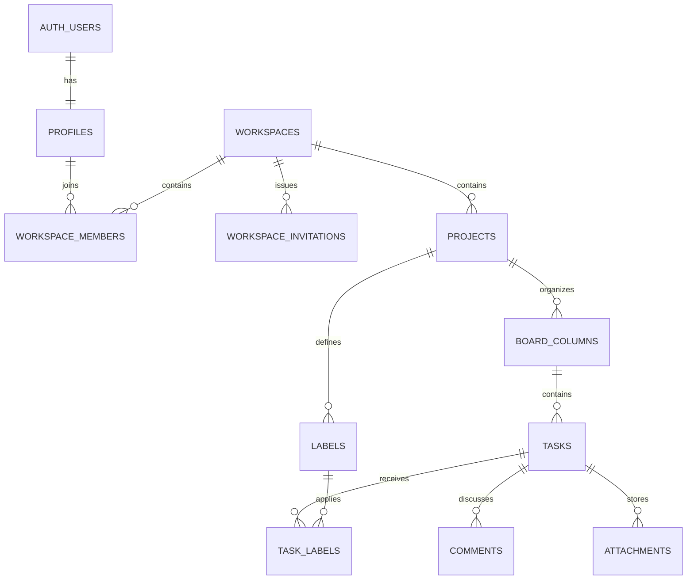

# Database architecture

Relay stores authorization at the workspace boundary. Every product table is protected by PostgreSQL Row Level Security, and workspace-scoped child records carry `workspace_id` with composite foreign keys that prevent cross-workspace relationships.



## Roles

| Capability                             | Owner | Admin | Member |
| -------------------------------------- | ----- | ----- | ------ |
| Read workspace data                    | Yes   | Yes   | Yes    |
| Manage invitations and non-owner roles | Yes   | Yes   | No     |
| Manage workspace settings and projects | Yes   | Yes   | No     |
| Delete workspace                       | Yes   | No    | No     |
| Create, edit, move, and archive tasks  | Yes   | Yes   | Yes    |
| Manage project labels                  | Yes   | Yes   | No     |
| Edit/delete own comments               | Yes   | Yes   | Yes    |
| Change or remove Owner directly        | No    | No    | No     |

Owner transfer uses a dedicated transactional RPC. Direct table policies still cannot create, update, or delete an existing Owner membership.

## Security model

- `private` contains security-definer membership helpers and is not exposed by PostgREST.
- `anon` has no privileges on application tables.
- `authenticated` receives only the table operations required by the product rules; RLS further restricts rows.
- `service_role` remains server-only and bypasses RLS for tightly scoped administrative workflows.
- Projects and tasks archive instead of exposing hard-delete operations.
- Task assignees are constrained to members of the same workspace.
- Task, label, comment, and attachment relationships use composite keys to prevent cross-project or cross-workspace references.
- `complete_onboarding` validates the authenticated user and creates the profile update, first workspace, and Owner membership atomically. Repeated submissions return the existing workspace instead of creating duplicates.
- Workspace management uses narrow RPCs for atomic creation, email-matched invitation acceptance, membership changes, leaving, and Owner transfer. Invitation rows store only SHA-256 token hashes and public previews expose masked email hints.
- `create_project` authorizes Owner/Admin access and creates a project with its five ordered default columns atomically, so partially initialized boards cannot be produced through the application flow.
- Task creation, editing, movement, and archive/restore use narrow security-definer RPCs. Each function verifies active-project state and workspace membership; assignment and labels must belong to the task workspace/project.
- `move_task` locks the task and target column, validates optional previous and next task IDs, and calculates the new gapped position in one transaction. When adjacent positions are exhausted, it safely normalizes the target column before completing the move. The client never supplies a raw database position.
- `tasks` uses full replica identity and belongs to the `supabase_realtime` publication. Realtime delivery still passes through the authenticated user's task RLS policy.
- `comments` uses full replica identity and the Realtime publication. User-facing deletion sets `deleted_at`, so filtered subscribers receive the change and remove the comment without a reload; only the author can edit or delete it.
- `task-attachments` is a private Storage bucket. Object paths are exactly `workspace/project/task/uuid`; Storage RLS resolves that path back to an accessible task, while `create_attachment` registers separate file metadata only after the authenticated uploader's object exists.

## Verification

`supabase/tests/database` contains pgTAP schema and RLS tests for Owner, Admin, Member, outsider, and anonymous access. Run the complete database gate with:

```bash
pnpm db:start
pnpm db:verify
```

Regenerate checked-in database types after every schema change:

```bash
pnpm db:types
```
